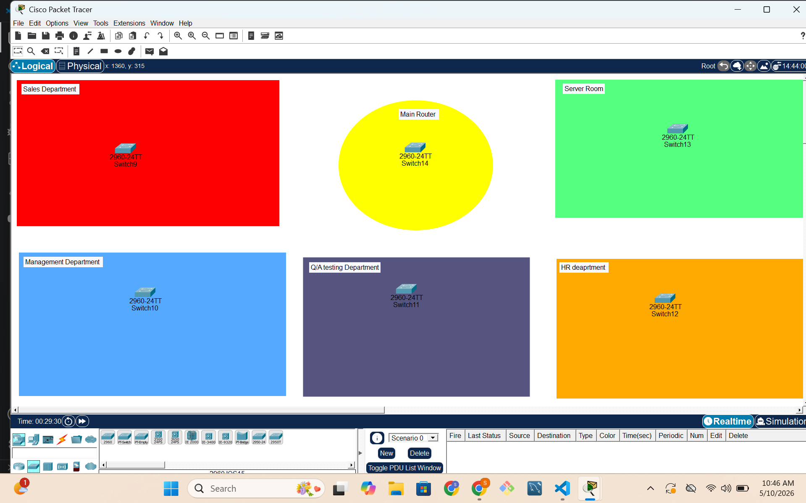
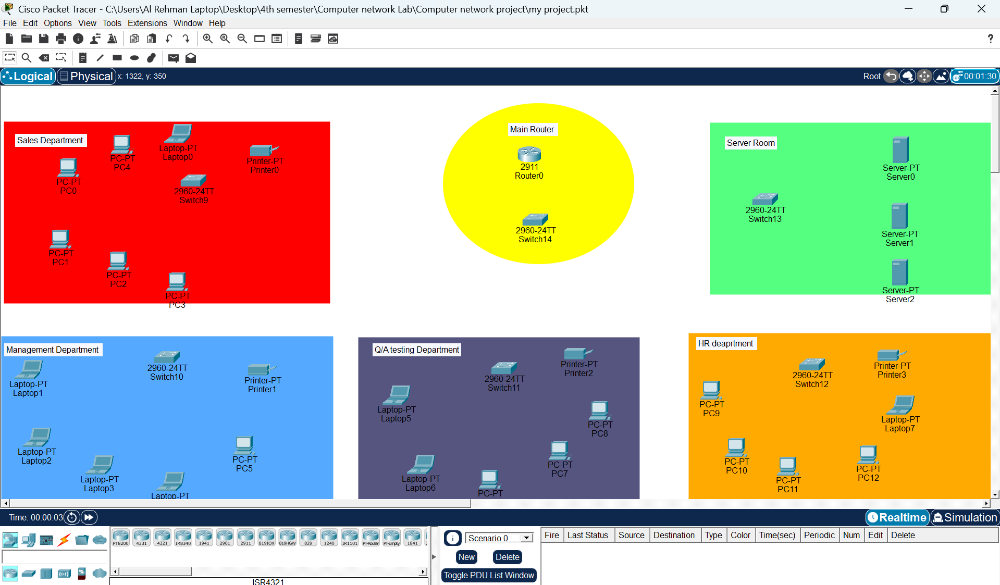
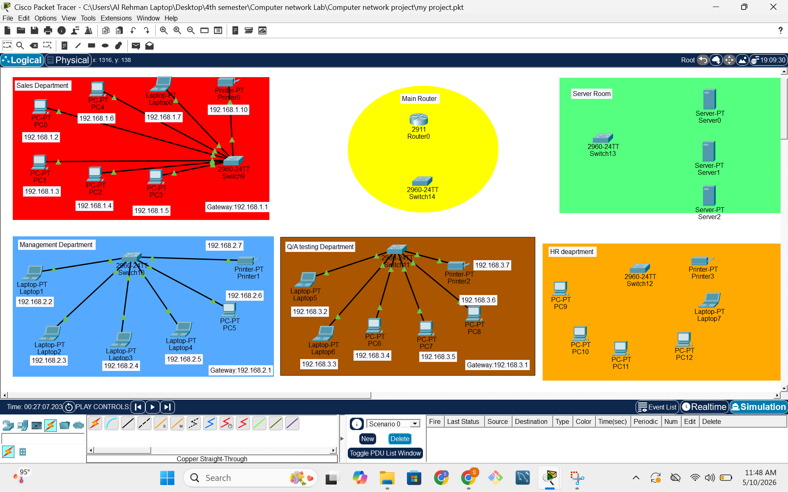
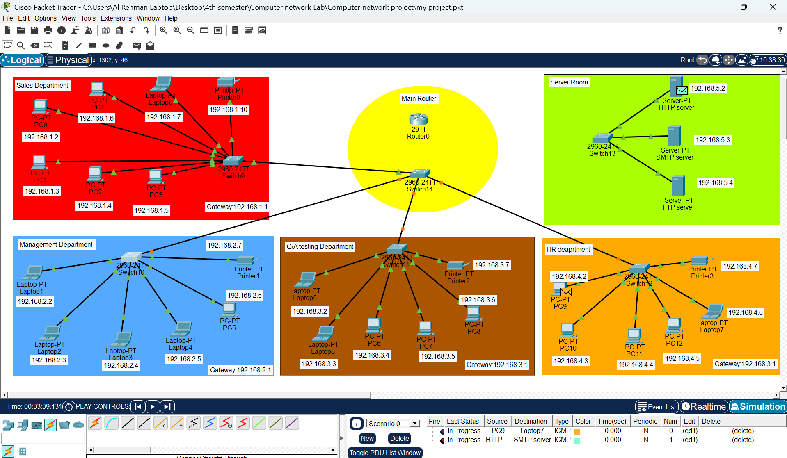
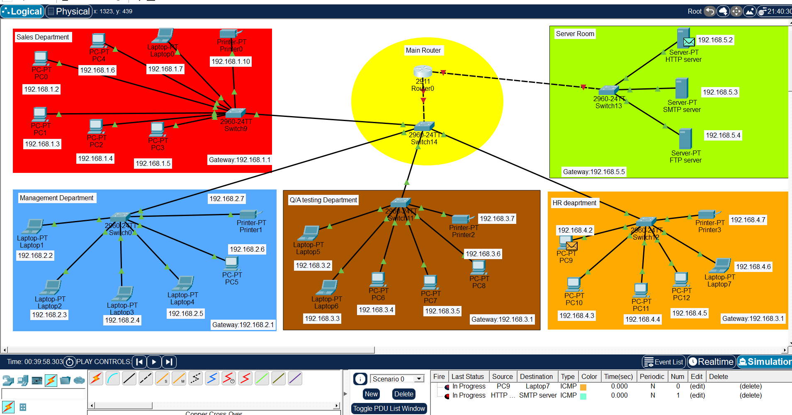
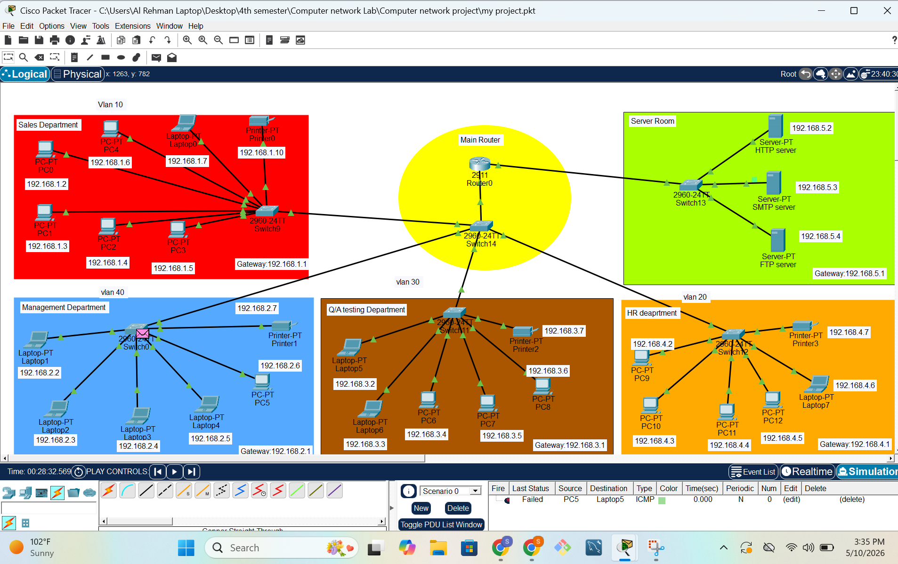
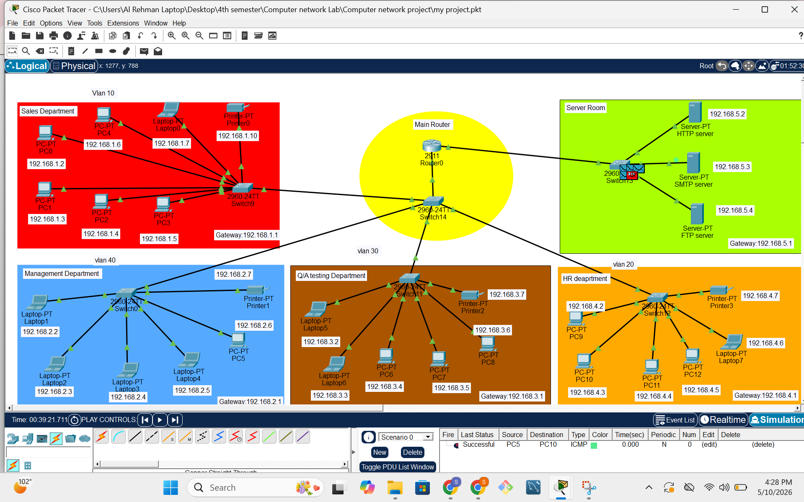

# 🖧 Software House Network Design & Implementation

A fully functional enterprise-grade Local Area Network (LAN) designed and simulated using **Cisco Packet Tracer** for a software house environment with 5 departments, VLAN segmentation, inter-VLAN routing, and a centralized server room.

---

# 📌 Project Overview

This project simulates a real-world **software house network** serving 5 departments. Each department is logically separated using **VLANs** for security and traffic isolation, while a central **Cisco 2811 Router** handles inter-department communication using the **Router-on-a-Stick** technique.

| Feature             | Details                                                 |
| ------------------- | ------------------------------------------------------- |
| **Simulation Tool** | Cisco Packet Tracer                                     |
| **Network Type**    | LAN with VLAN Segmentation                              |
| **Routing Method**  | Inter-VLAN Routing (Router-on-a-Stick)                  |
| **Departments**     | 5 (Sales, HR, Q/A, Management, Server Room)             |
| **Devices**         | 1 Router, 6 Switches, 20+ End Devices, 3 Servers        |
| **Course**          | CS-512 Computer Networks — COMSATS University Islamabad |

---

# 🏗️ Network Architecture

## Three-Tier Hierarchical Design

```text
┌────────────────────────────────────┐
│          CORE LAYER                │
│    Cisco 2811 Router (Router0)     │
│  Inter-VLAN Routing | Gig0/0-0/1   │
└──────────────┬─────────────────────┘
               │
┌──────────────▼─────────────────────┐
│       DISTRIBUTION LAYER           │
│   Cisco 2960 Switch14 (Central)    │
│   Trunk links to all departments   │
└──┬────────┬──────────┬──────────┬──┘
   │        │          │          │
┌──▼──┐  ┌──▼──┐   ┌──▼──┐   ┌──▼──┐
│SW9  │  │SW12 │   │SW11 │   │SW0  │
│Sales│  │ HR  │   │ Q/A │   │Mgmt │
│VLAN │  │VLAN │   │VLAN │   │VLAN │
│ 10  │  │ 20  │   │ 30  │   │ 40  │
└─────┘  └─────┘   └─────┘   └─────┘
```

---

# 🔀 VLAN Configuration

| VLAN ID | Name        | Department       | Switch     | Subnet         |
| ------- | ----------- | ---------------- | ---------- | -------------- |
| 10      | Sales       | Sales Department | Switch9    | 192.168.1.0/24 |
| 20      | HR          | Human Resources  | Switch12   | 192.168.4.0/24 |
| 30      | Q/A         | Q/A Testing      | Switch11   | 192.168.3.0/24 |
| 40      | Management  | Switch0          | Management | 192.168.2.0/24 |
| —       | Server Room | HTTP/SMTP/FTP    | Switch13   | 192.168.5.0/24 |

---

# 🌐 IP Addressing Scheme

All devices are statically configured with IP addresses and default gateways pointing to the router subinterface for their VLAN.

## Default Gateways

* Sales → `192.168.1.1` (Gig0/0.10)
* HR → `192.168.4.1` (Gig0/0.20)
* Q/A → `192.168.3.1` (Gig0/0.30)
* Management → `192.168.2.1` (Gig0/0.40)
* Server Room → `192.168.5.1` (Gig0/1)

---

# 🖥️ Server Room

| Server      | IP Address  | Protocol | Port |
| ----------- | ----------- | -------- | ---- |
| HTTP Server | 192.168.5.2 | HTTP     | 80   |
| SMTP Server | 192.168.5.3 | SMTP     | 25   |
| FTP Server  | 192.168.5.4 | FTP      | 21   |

All servers are accessible from every department through the central router.

---

# ⚙️ Key Router Configuration (IOS Commands)

```cisco
interface GigabitEthernet0/0.10
 encapsulation dot1Q 10
 ip address 192.168.1.1 255.255.255.0

interface GigabitEthernet0/0.20
 encapsulation dot1Q 20
 ip address 192.168.4.1 255.255.255.0

interface GigabitEthernet0/0.30
 encapsulation dot1Q 30
 ip address 192.168.3.1 255.255.255.0

interface GigabitEthernet0/0.40
 encapsulation dot1Q 40
 ip address 192.168.2.1 255.255.255.0

interface GigabitEthernet0/1
 ip address 192.168.5.1 255.255.255.0
 no shutdown
```

---

# 🧪 Project Development Progress

## 1️⃣ Initial Network Structure Setup

Only switches were placed to design the basic hierarchical network topology.



---

## 2️⃣ Adding End Devices

PCs, laptops, printers, and servers were added to each department.



---

## 3️⃣ IP Addressing & Cabling

Static IP addresses were assigned and all network devices were connected using proper cables.



---

## 4️⃣ Router Configuration & Server Room Setup

Router-on-a-Stick configuration was implemented and the server room was connected.



---

## 5️⃣ Simulation Mode Testing

ICMP packets were tested in simulation mode. Dashed lines represent packets moving through the network.



---

## 6️⃣ VLAN Verification & Troubleshooting

Final VLAN labels were verified. One failed ping is also visible during troubleshooting and testing.



---

# ✅ Final Successful Output

Successful inter-VLAN communication achieved between devices across departments.

Example:

* **PC5 → PC10 Successful Ping**



---

# ✅ Testing & Verification

| Test                    | Method                              | Result         |
| ----------------------- | ----------------------------------- | -------------- |
| Intra-VLAN Connectivity | Ping within same department         | ✅ Successful   |
| Inter-VLAN Connectivity | Ping across departments             | ✅ Successful   |
| Server Reachability     | Ping to all servers from every VLAN | ✅ Successful   |
| Trunk Verification      | `show interfaces trunk`             | ✅ VLANs active |

---

# 🧠 Concepts Demonstrated

* VLAN Segmentation
* 802.1Q Trunking
* Inter-VLAN Routing
* Router-on-a-Stick
* Hierarchical Network Design
* Static IP Addressing
* HTTP / SMTP / FTP Services
* ICMP Connectivity Testing
* Network Troubleshooting

---

# 📁 Project Files

```text
📦 software-house-network/
 ┣ 📄 my project.pkt
 ┣ 📄 Project_Report.docx
 ┣ 📄 README.md
 ┣ 🖼️ 1.png
 ┣ 🖼️ 2.png
 ┣ 🖼️ 3.png
 ┣ 🖼️ 4.png
 ┣ 🖼️ 5.png
 ┣ 🖼️ 6.png
 ┗ 🖼️ final.png
```

---

# 👩‍💻 Author

**Sara Amanzoor**
BS Computer Science — University of Layyah
Course: CS-512 Computer Networks
Instructor: Sir Umer Daraz
May 2026

---

*Simulated using Cisco Packet Tracer | Enterprise Networking Concepts*
